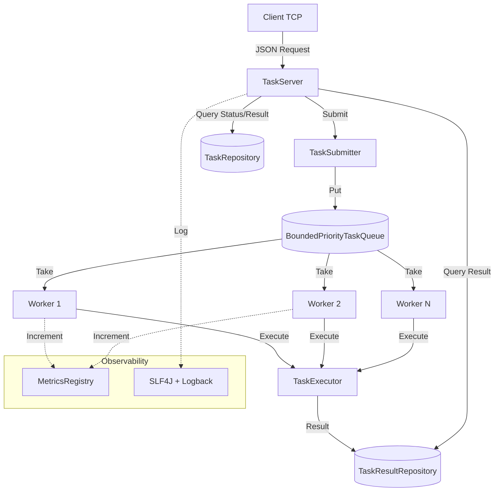
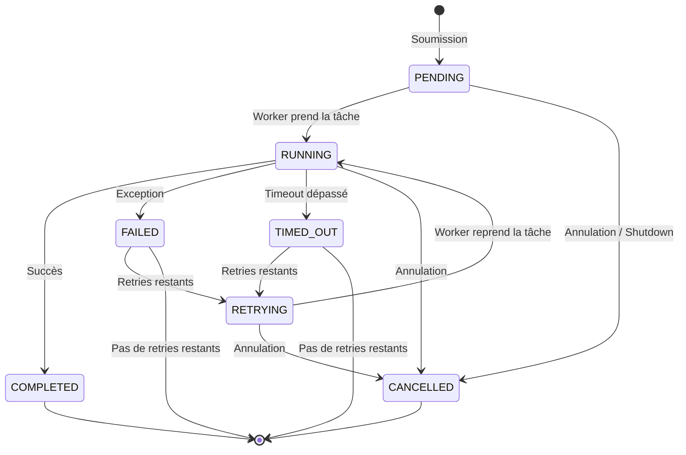
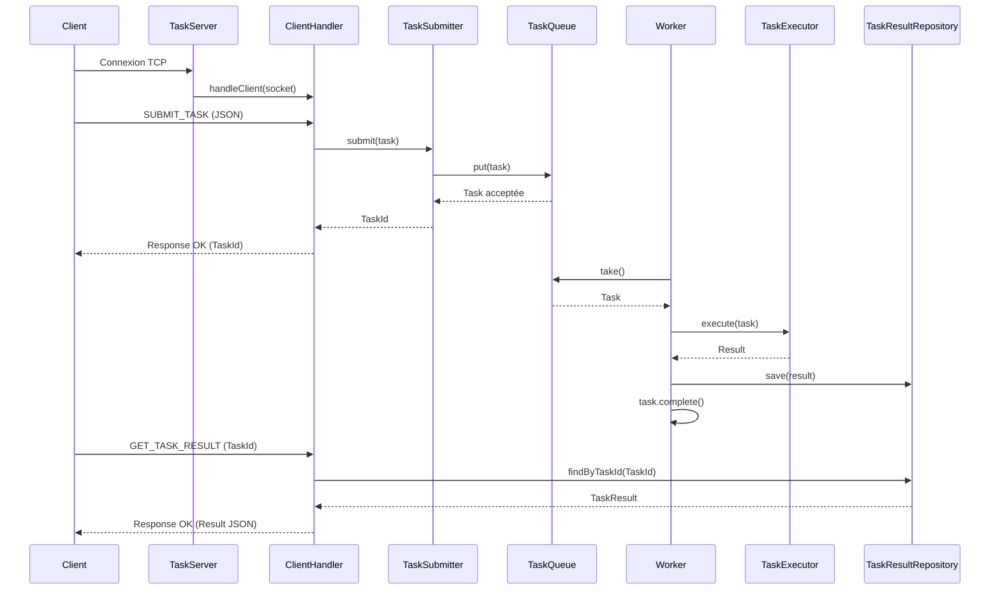
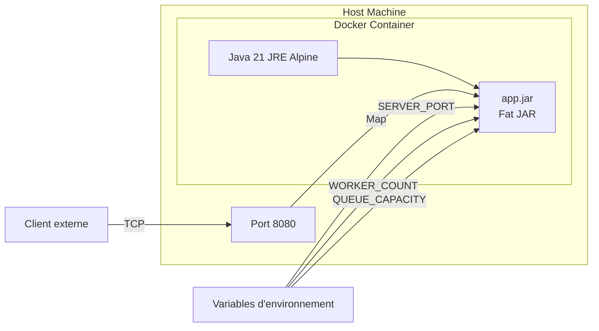

# TaskForge


**TaskForge** est un système de traitement de tâches asynchrone écrit en **Java natif** (sans framework), conçu pour démontrer une compréhension approfondie des concepts backend : concurrence, networking, worker pools, retry, timeout, observabilité et conteneurisation.

## 🎯 Problème résolu

Les systèmes backend modernes doivent souvent traiter des tâches longues ou coûteuses de manière asynchrone :
- Envoi d'emails
- Génération de rapports
- Traitement de fichiers
- Calculs intensifs

TaskForge fournit un moteur léger qui :
- Accepte des tâches via un protocole TCP/JSON.
- Les stocke dans une queue prioritaire bornée.
- Les distribue à un pool de workers.
- Gère les échecs avec retry et backoff exponentiel.
- Applique des timeouts pour éviter les blocages.
- Expose des métriques et des logs structurés.

## 🏗️ Architecture



## 🔄 Cycle de vie d'une tâche



## Diagramme de séquence : Soumission d'une tâche



## Diagramme de déploiement Docker



## ⚙️ Fonctionnalités

- Queue prioritaire bornée : PriorityQueue protégée par ReentrantLock avec backpressure.
- Worker Pool : ExecutorService avec threads nommés et arrêt gracieux.
- Retry avec backoff exponentiel : 100ms → 200ms → 400ms → ... avec plafond.
- Timeout : Chaque tâche a un timeout configurable, géré via Future.get(timeout).
- Observabilité : Métriques compteurs et logs structurés (SLF4J + Logback).
- Réseau TCP : Serveur multi-clients avec protocole JSON et keep-alive.
- Graceful Shutdown : Arrêt propre du serveur, de la queue et des workers.
- Docker : Image multi-stage build, utilisateur non-root, configuration par env vars.
- CI/CD : GitHub Actions avec tests, build Docker et publication sur GHCR.

## 🚀 Démarrage rapide

### Prérequis
- Java 21+
- Maven 3.9+
- Docker (optionnel)

### Lancer localement

```bash
mvn clean compile exec:java
```

### Lancer avec Docker

```bash
docker pull ghcr.io/delfred237/taskforge:latest
docker run -d -p 8080:8080 ghcr.io/<ton-username>/taskforge:latest
```

### Interagir avec le serveur

```bash
# Soumettre une tâche
echo '{"requestId":"1", "action":"SUBMIT_TASK", "payload":"{\"type\":\"COMPUTATION\", \"data\":\"100\", \"priority\":\"HIGH\", \"timeoutMs\":5000}"}' | nc localhost 8080

# Vérifier le statut
echo '{"requestId":"2", "action":"GET_TASK_STATUS", "payload":"<task-id>"}' | nc localhost 8080

# Statut du serveur
echo '{"requestId":"3", "action":"SERVER_STATUS", "payload":""}' | nc localhost 8080
```

## 🧪 Tests

```bash
# Tous les tests
mvn clean test

# Tests de charge uniquement
mvn test -Dtest=LoadSimulationTest

# Tests d'intégration réseau
mvn test -Dtest=TaskForgeSystemIntegrationTest
```

**Couverture actuelle :**
- Tests unitaires du domaine (Task, Status, Priority)
- Tests de concurrence (Producer/Consumer, multi-workers)
- Tests de retry et timeout
- Tests d'intégration réseau (client/serveur TCP)
- Tests de charge (1000 tâches simultanées)

## 🧪 Tests

| Métrique           | Description                      |
| ------------------ | -------------------------------- |
| `tasks.submitted`  | Nombre de tâches soumises        |
| `tasks.completed`  | Nombre de tâches complétées      |
| `tasks.failed`     | Nombre de tâches échouées        |
| `tasks.timeout`    | Nombre de timeouts               |
| `tasks.retried`    | Nombre de retries effectués      |
| `network.requests` | Nombre de requêtes réseau reçues |
| `network.errors`   | Nombre d'erreurs réseau          |

## 🐳 Configuration Docker

| Variable          | Défaut | Description                         |
| ----------------- | -----: | ----------------------------------- |
| `SERVER_PORT`     | `8080` | Port TCP du serveur                 |
| `WORKER_COUNT`    |    `4` | Nombre de workers                   |
| `QUEUE_CAPACITY`  |  `100` | Capacité maximale de la queue       |
| `TASK_TIMEOUT_MS` | `5000` | Timeout par défaut des tâches (ms)  |
| `MAX_RETRIES`     |    `2` | Nombre maximum de retries par tâche |

## 🛠️ Stack technique

- Java 21 (LTS)
- Maven (build)
- JUnit 5 (tests)
- SLF4J + Logback (logging)
- Gson (JSON)
- Docker (conteneurisation)
- GitHub Actions (CI/CD)
- GitHub Container Registry (distribution)

## 📚 Défis techniques rencontrés

1. Race conditions sur les collections : ArrayList non thread-safe corrompu par des producteurs concurrents → remplacé par Collections.synchronizedList.
2. Visibilité des résultats : Le worker sauvegardait le résultat après avoir changé le statut, créant une fenêtre où le statut était terminal mais le résultat absent → inversion de l'ordre.
3. Sérialisation Gson : Instant et UUID non supportés nativement → création de TypeAdapter personnalisés.
4. Connexions TCP multiples : Le serveur fermait la connexion après une requête → implémentation du keep-alive avec boucle readLine().
5. Fat JAR : Le JAR standard ne contenait pas les dépendances → ajout de maven-shade-plugin.

## 🚧 Limitations actuelles

- Persistance en mémoire : Les tâches et résultats sont perdus au redémarrage.
- Pas de sécurité : Pas d'authentification, pas de TLS.
- Protocole custom : Pas de HTTP, pas de WebSocket.
- Pas de distribution : Un seul serveur, pas de clustering.
- Pas de dead letter queue : Les tâches qui échouent définitivement sont simplement marquées FAILED.

## 🚧 Limitations actuelles

- Persistance fichier/base de données.
- API HTTP REST.
- Authentification JWT.
- Distributed tracing (OpenTelemetry).
- Dead letter queue.
- Web dashboard pour le monitoring.
- Support de Kubernetes.

## 📄 Licence
MIT